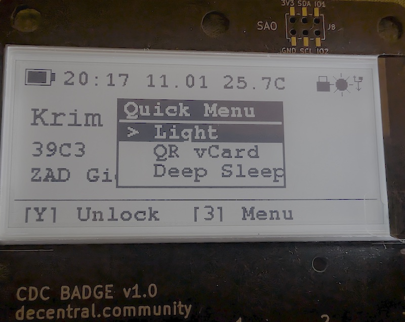

# CDC Badge OS

Hardware security key firmware for the CDC Badge v1.0 featuring TROPIC01 secure element.



> **Early Alpha** - This firmware is in early development and **not production ready**. Security hardening is incomplete and known vulnerabilities exist. Do not use for protecting critical accounts. See [SECURITY.md](SECURITY.md) for hardening steps required before production use.

> **Development note** - Active development happens on GitLab. GitHub receives periodic bulk pushes of the `release` branch only (for reasons). ;)

## Features

| Feature | Description |
|---------|-------------|
| **FIDO2/WebAuthn** | FIDO 2.1 compliant passwordless authentication (USB HID) - Chrome, Firefox, Edge |
| **SSH Hardware Keys** | Native SSH via ed25519-sk (OpenSSH 8.2+, no driver needed) |
| **Password Vault** | Secure password storage in TROPIC01 (up to 362 entries with auto-type) |
| **Certificate Authority** | On-device CA with CSR signing, root import/export (v0.5, untested) |
| **GPG Key Management** | GPG key storage via TROPIC01, USB CCID SmartCard (v0.5, untested) |
| **U2F** | Legacy two-factor authentication |
| **TOTP Authenticator** | Time-based one-time passwords (100 accounts, Google Authenticator compatible) |
| **USB Keyboard** | Auto-type TOTP codes and passwords via HID |
| **BLE UART** | Wireless serial console via Bluetooth (Nordic UART Service) |
| **BLE vCard (Badge2Badge)** | Broadcast mini-card + vCard exchange + QR export |
| **Secure Serial** | PIN authentication for sensitive serial commands with anti-bruteforce |
| **WiFi + NTP** | Time synchronization over WiFi |
| **E-Paper Display** | 2.9" low-power display with backlight |
| **12-Button Keypad** | Phone-style T9 input |
| **SAO Port** | badge.team SAO detection and info display (no drivers) |
| **Multi-Language** | English and German UI (expandable, translaters welcome) |

> **Note:** WiFi and Bluetooth are currently **mutually exclusive** (enable one at a time).

> **Warning:** WiFi is currently unstable and crashes easily. Need different hardware to debug (help wanted).

### Bluetooth Serial (BLE UART)

BLE UART uses the Nordic UART Service (NUS).  
Android app: **Serial Bluetooth Terminal** (Kai Morich) on Google Play. citeturn0search4turn0search0

Google Play:
```
https://play.google.com/store/apps/details?id=de.kai_morich.serial_bluetooth_terminal
```

### BLE vCard (Badge2Badge)

What it does:
- Broadcasts a short mini-card (name + short info) via BLE advertising
- Exchanges full vCard 4.0 **badge-to-badge only** (custom GATT)
- Shows a QR code for interoperability with phones/computers (no app required)
- Stores up to 100 received vCards in NVS (max 768 bytes each), sorted by last name

See [BLE vCard Protocol](docs/ble_vcard_protocol.md) for technical details.

Notes:
- BLE UART is disabled while the vCard feature is active
- BLE and WiFi are mutually exclusive
- **Exchange is currently untested** (Only one badge available for testing)

### Secure Serial

Serial commands require PIN authentication when `FEATURE_SECURE_SERIAL` is enabled.

- Use `AUTH <pin>` to authenticate
- Use `LOGOUT` to end session

### GPG Key Management (v0.5 - Untested)

> **Warning:** This feature is planned for v0.5 and completely untested.

GPG key storage using TROPIC01 secure element with USB CCID SmartCard interface.

**Features:**
- Ed25519 and P-256 key generation on TROPIC01
- USB CCID SmartCard interface (optional, for GnuPG)
- Cross-signing with other badges via BLE
- QR code export of public key

**On-device UI:**
- Generate key (name, email, curve selection via T9 input)
- View status (fingerprint, user ID, sign count)
- Export public key as QR code
- Browse and sign received keys from other badges

Enable in `feature_flags.h`:
```c
#define FEATURE_GPG 1       // GPG key storage
#define FEATURE_GPG_CCID 0  // USB CCID (disabled by default)
```

See [docs/GPG.md](docs/GPG.md) for detailed documentation.

### Password Vault

Hardware-secured password storage using the TROPIC01 secure element.

**Features:**
- Up to 362 password entries (R-Memory slots 150-511)
- Passwords stored encrypted in TROPIC01 (never leave the chip in plaintext)
- Metadata (name, username, URL) stored in NVS for quick listing
- Auto-type passwords via USB HID keyboard
- Notes field for additional information (up to 256 chars)

**Storage:**
- Password: max 96 characters
- Notes: max 256 characters
- Name/Username: max 32 characters each
- URL: max 64 characters

**On-device UI:**
- Browse passwords alphabetically sorted
- View entry details (name, username, URL)
- Auto-type password with optional Enter key
- Add/Edit/Delete via T9 input

**Serial commands** are easier for bulk management - see Serial Commands section.

### SAO Port (Basic Detection Only)

Basic SAO (Standardized Add-On) support following the [badge.team Binary Descriptor](https://badge.team/docs/standards/sao/binary_descriptor/) standard.

**What it does:**
- Detects SAO modules via I2C EEPROM at address 0x50
- Parses Binary Descriptor (name, driver info)
- Shows SAO icon on lock screen when detected
- Displays SAO info in Tools menu

**What it doesn't do:**
- Just detection and info display as i dont have any compatible hardware to test it with to write a driver for

**Hardware:**
- SAO Port (J5): I2C1 (GPIO47/48), GPIO15, GPIO16
- EEPROM standard: badge.team Binary Descriptor ("LIFE" magic)

Enable in `feature_flags.h`:
```c
#define FEATURE_SAO 1
```

### Certificate Authority (v0.5 - Untested)

> **Warning:** This feature is planned for v0.5 and completely untested.

On-device CA for signing CSRs and managing certificates.

## Security Architecture

| Feature | Implementation |
|---------|----------------|
| **Key Storage** | All private keys stored in TROPIC01 secure element |
| **Key Generation** | P-256 and Ed25519 keys generated on-chip, never exported |
| **PIN Protection** | 4-6 digit PIN with 3 attempt lockout |
| **FIDO2 ClientPIN** | Full Protocol 2 support with HKDF-SHA256 |
| **Attestation** | Self-signed attestation (device-unique AAGUID) |
| **User Verification** | PIN verified via device or ClientPIN protocol |

### TROPIC01 Secure Element

The TROPIC01 provides hardware-backed security:
- 32 ECC key slots (P-256 and Ed25519)
- 512 R-Memory slots (444 bytes each)
- Hardware random number generator
- Tamper-resistant key storage
- Keys cannot be extracted or cloned

### FIDO2 Compliance (CTAP 2.1)

Supported CTAP 2.1 operations:
- `authenticatorMakeCredential` - Register new credentials (resident keys supported)
- `authenticatorGetAssertion` - Authenticate with existing credentials
- `authenticatorGetInfo` - Device capabilities (FIDO_2_1 version string)
- `authenticatorClientPIN` - PIN management (Protocol 2 with pinUvAuthToken)
- `authenticatorCredentialManagement` - List and delete stored credentials
- `authenticatorReset` - Factory reset

Extensions: `credProtect`, `appid`, `appidExclude`

## Storage Map

### TROPIC01 ECC Key Slots (32 Slots)

| Slot | Purpose |
|------|---------|
| 0-28 | FIDO2/WebAuthn/SSH (P-256 or Ed25519) |
| 29 | GPG Master Key |
| 30 | FIDO2 Attestation Key |
| 31 | CA Root Key |

### TROPIC01 R-Memory Slots (512 × 444 Bytes)

| Slot | Purpose |
|------|---------|
| 0-28 | FIDO2 Credential Metadata |
| 29 | GPG Metadata |
| 30 | PIN Hash (SHA-256) |
| 31 | Device Config |
| 32 | CA Metadata |
| 33-132 | TOTP Accounts (max 100) |
| 133-149 | Free |
| 150-511 | Password Vault Entries |

### NVS (ESP32 Flash)

| Namespace | Key | Description |
|-----------|-----|-------------|
| `rtc` | `time_set` | Flag if time was set |
| `display` | `backlight` | Backlight brightness |
| `badge` | `name`, `info`, `info2` | Display text |
| `fido2` | `auth_count` | Global auth counter |
| `vcard` | `own`, `c_*` | Own vCard, collected vCards |
| `pass` | `p###` | Password vault metadata (name/user/url) |

## Hardware

| Component | Model |
|-----------|-------|
| MCU | ESP32-S3-WROOM-1 |
| Display | GDEY029T94-FL03 (2.9" E-Paper + Frontlight) |
| Secure Element | TROPIC01 |
| I/O Expander | TCA9535 (Keypad) |
| Power IC | BQ25895 (LiPo Charger) |

For schematics and PCB design: https://github.com/riatlabs/cdc-badge

## Getting Started

### First-Time Setup

1. **Change the default PIN** (Settings -> Change PIN)
   - Default PIN: `1234`
   - FIDO2 requires a non-default PIN

2. **Set the time** via WiFi NTP or serial command:
   ```bash
   echo "SET_DATE $(date +%s)" > /dev/ttyACM0
   ```

3. **Register your first WebAuthn credential** at a supported site

### Using FIDO2/WebAuthn

1. Navigate to a WebAuthn-enabled site (e.g., GitHub, Google)
2. When prompted, the badge displays the site name
3. Press **Y** to approve, **N** to deny
4. If device was locked, enter PIN on badge (or via browser if prompted)

### Using SSH Hardware Keys

SSH support works via FIDO2 (OpenSSH 8.2+ required, no driver needed):

```bash
# Generate Ed25519-SK resident key on badge
ssh-keygen -t ed25519-sk -O resident -O application=ssh:myserver

# Export public keys from badge
ssh-keygen -K

# Connect (badge prompts for confirmation)
ssh user@server
```

The badge stores the private key in the TROPIC01 secure element. Each SSH connection requires physical confirmation (press Y on badge).

### Using TOTP

1. Add accounts via manual entry (serial is much more easy to use)
2. View codes in the TOTP menu
3. Press **Y** to auto-type code via USB keyboard

## Power Management

| Mode | Trigger | Wake |
|------|---------|------|
| Active | Normal use | - |
| Light Sleep | Lock screen idle | Any key |
| Deep Sleep | Hold N 5s on lock | Y key only |
| Shipping | Hold BOOT 3s | USB power |

## Build & Flash

Requires PlatformIO with ESP-IDF framework.

```bash
git submodule update --init --recursive
pio run
pio run -t upload
```

## UI Components

Reusable view components for the E-Paper display:

| View | Description |
|------|-------------|
| **Lock Screen** | Status display with battery, clock, name, status icons |
| **List Screen** | Scrollable selection menu (max 32 items, 4 visible) |
| **Info Screen** | Scrollable long text display |
| **T9 Input** | Text input with phone-style T9 multi-tap |
| **PIN Entry** | Secure PIN input with attempt counter |
| **Slider** | Value adjustment with visual progress bar |
| **Date Input** | Date entry (DD.MM.YYYY) |
| **Time Input** | Time entry (HH:MM) |
| **TOTP Code** | Code display with countdown progress bar |
| **Context Menu** | Popup overlay menu |
| **Toast** | Success/error message overlay |

Status bar icons: Lock, Deep Sleep, Light Sleep, Backlight, USB, BLE, WiFi

## Serial Commands

Connect at 115200 baud via USB CDC.

### Authentication (when FEATURE_SECURE_SERIAL enabled)
| Command | Description |
|---------|-------------|
| `AUTH <pin>` | Authenticate with PIN |
| `LOGOUT` | End authenticated session |

### System
| Command | Description |
|---------|-------------|
| `HELP` | Show all commands |
| `PING` | Connection test (returns PONG) |
| `STATUS` | Badge status overview |
| `ERROR_LOG` | Show captured errors (max 50) |
| `ERROR_LOG_CLEAR` | Clear error log |

### Time
| Command | Description |
|---------|-------------|
| `SET_TIME HH:MM:SS` | Set time |
| `SET_DATE YYYY-MM-DD` | Set date |
| `SET_DATE <timestamp>` | Set from Unix timestamp |
| `GET_TIME` | Get current time |
| `GET_DATE` | Get current date |

### Display
| Command | Description |
|---------|-------------|
| `SET_NAME text` | Set display name |
| `SET_INFO text` | Set info line |
| `SET_INFO2 text` | Set second info line |

### TOTP
| Command | Description |
|---------|-------------|
| `TOTP_LIST` | List all accounts |
| `TOTP_ADD name secret [issuer] [digits] [period] [algo]` | Add account |
| `TOTP_DEL <index>` | Delete account |
| `TOTP_GET <index>` | Generate code |
| `TOTP_TYPE <index> [enter]` | Type code via USB keyboard |

### FIDO2
| Command | Description |
|---------|-------------|
| `FIDO_STATUS` | FIDO2 module status |
| `FIDO_LIST` | List all credentials |
| `FIDO_DEL <index>` | Delete credential |
| `FIDO_RESET` | Factory reset (requires CONFIRM) |

### Password Vault
| Command | Description |
|---------|-------------|
| `PASS_LIST` | List all entries (sorted by name) |
| `PASS_ADD name user url password [notes]` | Add new entry |
| `PASS_EDIT index name user url password [notes]` | Edit existing entry |
| `PASS_DEL <index>` | Delete entry |
| `PASS_GET <index>` | Show entry details (including password) |
| `PASS_SEND <index> [enter]` | Type password via USB keyboard |

### vCard
| Command | Description |
|---------|-------------|
| `VCARD_SET` | Import vCard (multi-line, end with `---`) |
| `VCARD_GET` | Export vCard (template if empty) |
| `VCARD_DELETE` | Delete own vCard |

### TROPIC01
| Command | Description |
|---------|-------------|
| `TR01_STATUS` | Secure element status |
| `TR01_INFO` | Chip ID and firmware version |
| `TR01_SLOTS` | Show slot usage |
| `TR01_RESYNC` | Resync cache from chip |
| `TR01_RMEM_READ <slot>` | Read and dump R-memory slot |
| `TR01_ECC_DEL <slot>` | Delete ECC key |
| `TR01_RMEM_DEL <slot>` | Delete R-memory slot |
| `TR01_WIPE` | Factory reset all user data (requires CONFIRM) |

### GPG - v0.5, untested
| Command | Description |
|---------|-------------|
| `GPG_STATUS` | Show key status (user ID, fingerprint, sign count) |
| `GPG_GENERATE <curve> <user_id>` | Generate key (1=Ed25519, 2=P-256) |
| `GPG_EXPORT` | Export public key (PEM format) |
| `GPG_RESET` | Delete key (requires CONFIRM) |
| `GPG_RECV_LIST` | List received public keys |
| `GPG_RECV_INFO <index>` | Show received key details |
| `GPG_CROSS_SIGN <index>` | Cross-sign received key |
| `GPG_RECV_DELETE <index>` | Delete received key |

### CA (Certificate Authority) - v0.5, untested
| Command | Description |
|---------|-------------|
| `CA_STATUS` | CA status (CN, validity, issued count) |
| `CA_INIT [cn]` | Initialize new CA with common name |
| `CA_IMPORT` | Import existing CA (private key + cert PEM) |
| `CA_LIST` | List issued certificates |
| `CA_EXPORT_ROOT` | Export root certificate (PEM) |
| `CA_SIGN_CSR` | Sign CSR (paste PEM, end with `---`) |
| `CA_SIGN_CERT` | Re-sign existing certificate (cross-sign) |
| `CA_RESET` | Factory reset CA |

## License

GNU General Public License v3.0 - see [LICENSE.md](LICENSE.md)

---

## Disclaimer

*Co-developed with [Claude Code](https://claude.ai/code) by Anthropic.*  
This repository is a **proof-of-concept / demonstrator**. It may contain **serious bugs**, incomplete edge-case handling, and other “sharp edges”. Do **not** use it as-is for production or security-critical deployments.

While I’m experienced with cryptography and encryption concepts, this is my first project implemented directly on the ESP32. For ESP-IDF/embedded best practices I relied heavily on external guidance and reviews. As a result, you may still find non-idiomatic ESP32 code, suboptimal design patterns, duplication, or refactoring debt.

The intent is to clean this up before the first major release (v1.0.0), once I have more routine in ESP32 development and can consolidate patterns, structure, and implementation details specific for this device
