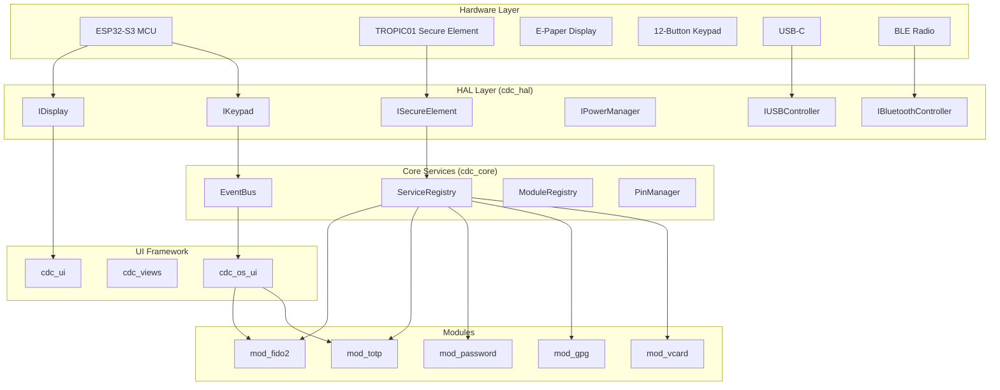

## Summary
The CDC Badge OS repository lacks a high-level system architecture diagram that visually shows the relationship between components, their boundaries, and how they communicate. While ASCII art diagrams exist in the README.md (lines 86-104), there is no comprehensive visual diagram showing:

- Component layers (HAL, Core, UI, Modules)
- Data flow between components
- Communication patterns (EventBus, ServiceRegistry, direct calls)
- External interfaces (USB, BLE, SPI, I2C)

**Evidence:**
- `README.md:86-104` - Contains only a basic ASCII box diagram
- `docs/README.md` - No diagrams beyond text
- `docs/UI_FLOWS.md` - Shows UI states but not system architecture
- No `.drawio`, `.svg`, or Mermaid diagram files in `/docs/` directory

## Impact
- New developers must reverse-engineer the architecture from code
- Hard to understand component interactions at a glance
- No visual reference for onboarding
- Makes it difficult to communicate design decisions to stakeholders
- The existing ASCII diagram is too simplified to show communication patterns

## Evidence
**Current state (from `README.md:86-104`):**
```
┌─────────────────────────────────────────────────────────────────┐
│                         Modules                                  │
│  mod_fido2 │ mod_totp │ mod_password │ mod_gpg │ mod_vcard │ ...│
├─────────────────────────────────────────────────────────────────┤
│                      OS UI (cdc_os_ui)                          │
│          Lock Screen │ Settings │ WiFi/BLE Menus                │
...
```

This shows hierarchy but NOT:
- How EventBus connects modules to core services
- How ServiceRegistry provides typed services (IKeyboardProvider, etc.)
- How TROPIC01 secure element is accessed through the HAL
- USB composite device (CDC/HID/CCID) architecture
- BLE protocol stack integration

## Recommended Fix
Create a system architecture diagram using one of these approaches:

**Option 1 (Recommended):** Add a Mermaid diagram to `docs/architecture.md`:


**Option 2:** Create a Draw.io file (`docs/architecture.drawio`) with layered C4-style container diagram.

**Option 3:** Generate from code using Doxygen with `\dotfile` directives.

The diagram should cover:
1. Component hierarchy (layers)
2. Key interfaces and their relationships
3. Data flow paths (events, services, direct calls)
4. Hardware interfaces (SPI, I2C, USB, BLE)

## References
- C4 Model: https://c4model.com/
- Mermaid.js: https://mermaid.js.org/
- Existing architecture described in `components/cdc_core/include/cdc_core/` headers
- Module interface: `components/cdc_core/include/cdc_core/IModule.h`
